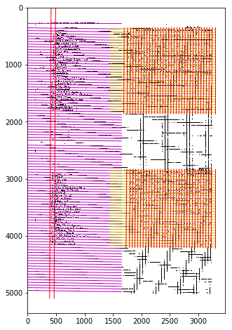

# Extract images of Boyd's Bird Journal into computer readable form

## Summary

(See images below)

The journals are PDFs containing a series of scanned images of observations of birds. The observations are scanned handwritten notes on graph paper. There are bird species labels running down the left side of the page and date information across the top. The charts are organized by month with days of the month being column headings. There are between up to three months of information for each image.

Each cell has a mark indicating the presence or absence of a bird species on a given day. So there is, potentially, one mark per bird species per day. The mark on the page is typically a forward slash "/" but it can also be an "x" or an asterisk. We are treating all types of marks the same, a cell either has a mark or it doesn't.

Somethings to note here:
- The graphs are not clean and contain notes and stray marks.
- The scans do not always have nice strong lines to pick out.
- The scans of the graphs are crooked and contain distortions, so the lines are slightly bent, typically near the edges.
- Some of the lines are incomplete or missing. In the image below, May 1986 has more grid cells than June 1986. And the line to the left of May 1st is incomplete.

We want to take the first image and produce two items from it.
1. An image indicating what we have extracted. Shown below.
    - Row and column labels are given a golden color.
    - Cells win a slash have a green color.
1. We are also producing a CSV file that can be used for analysis. Shown below the images.

### Input image

### Output image

This image is primarily useful for quality control checks.

### Output CSV file

file_name | chart_in_file | year | month | row_no | bird_species | 1 | 2 | 3 | 4 | 5 | 6 | ... | 30 | 31
--------- | --------------| ---- | ----- | ------ | ------------ | - | - | - | - | - | - | --- | -- | --
Boyd_M_Bird_journal_section1-024 | 1 | | | 1 | | 1 | 1 |   |   |   |   | ... |    |
Boyd_M_Bird_journal_section1-024 | 1 | | | 2 | | 1 | 1 | 1 | 1 | 1 | 1 | ... | 1  | 1
Boyd_M_Bird_journal_section1-024 | 1 | | | 3 | | 1 | 1 | 1 | 1 | 1 | 1 | ... |    |
Boyd_M_Bird_journal_section1-024 | 1 | | | 4 | | 1 | 1 |   | 1 |   | 1 | ... |    |
Boyd_M_Bird_journal_section1-024 | 1 | | | 5 | | 1 | 1 | 1 | 1 | 1 | 1 | ... | 1  | 1

## Brief description of the Hough transform

We're using the Hough Transform to find lines in the image. It's an efficient and old algorithm for finding objects in an image. Efficient because it only scans the image once.

The basic idea of the algorithm is:

1. Set up a table of every possible line in the image. The lines are in polar form (rho, theta).
    1. Lines are limited to a given set of angles.
    1. This table will hold a count of all of the "on" pixels for the line.
1. Scan the image for "on" pixels.
1. When a pixel is "on", add one to every possible line that goes thru the pixel it.
1. After every pixel has been recorded choose all lines with a count that is greater than a given threshold.

See the [Wikipedia Page](https://en.wikipedia.org/wiki/Hough_transform) for a more detailed description.

## Algorithm outline

As described in the summary the images are distorted and inconsistent. The general idea is to chop the image into workable pieces and parse that. Once we have parsed the image pieces we will reassemble the image for output. See the image below.

1. Chop the image into left and right halves. The left side will contain row labels and the right hand side contains the data grids with the slashes.
1. Find the grid lines and grid cells in the left side. (red and yellow lines) We use the *Hough Transform* to look for both vertical and horizontal grid lines. We do one pass for the horizontal lines and one for the vertical lines. Cells are the area between pairs of adjacent horizontal grid lines and pairs of vertical grid lines.
1. Examine the 2nd cell of every row and look for writing in it. Because this particular cell is very wide we will only look at the first 200 pixels of that cell. We will say that a cell with an average pixel brightness above a threshold contains writing.
1. We then group the rows with contiguous row labels into grids. In the image below there are two grids. We are assuming that each grid represents a month of data, days 1 up to 31.
1. Find the grid lines and cells for each grid on the right side of the image. (red and green lines) The uses the *Hough Transform* mentioned above.
1. Look for column headers for each of the grids on the right side. We will use both a mean pixel brightness and the *Probabilistic Hough Transform* for this.
1. Scan the grids for slashes. We only look at rows that have a row label and columns that have a column header. The scan uses the *Probabilistic Hough Transform* tuned to look for forward slashes.
1. Output the results to the output image file and to the CSV file.

The whole messy process for figuring this out is shown in the [experiments notebook](experiments_for_boyd_journal_extraction.ipynb).

